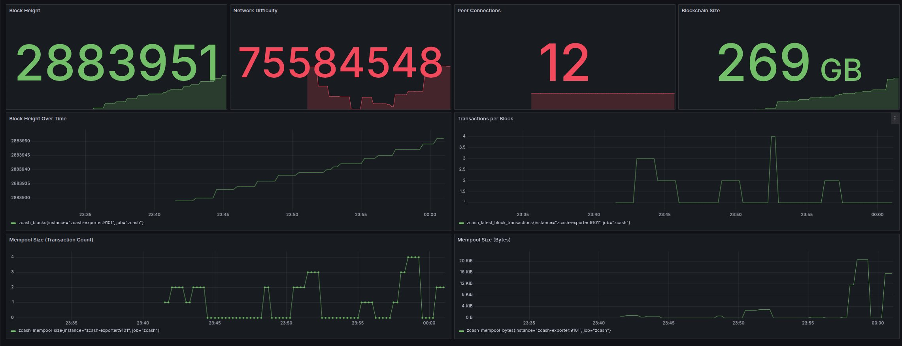

# Run your own Zcash infrastructure

WARNING: zebra + zaino is not fully working, yet.
An updated README will be provided to deploy more efficiently on different
cloud providers and bare metal servers.

The endgoal of this repository is to maintain an easy-to-deploy Zcash
infrastructure using docker-compose and rely on Makefile targets.
A setup using [cloud-init](https://cloudinit.readthedocs.io/en/latest/) is
being developed to be used on different kind of servers, and get a "one-click"
deployment.

See [the roadmap](#roadmap) for more information.



## Table of Contents

- [Environment Configuration](#environment-configuration)
- [Docker Compose Structure](#docker-compose-structure)
  - [Running the Services](#running-the-services)
- [Monitoring Setup](#monitoring-setup)
  - [Setup Instructions](#setup-instructions)
  - [Zcash Metrics](#zcash-metrics)
  - [Automatic Dashboard Provisioning](#automatic-dashboard-provisioning)
  - [Security Notes](#security-notes)
  - [Determining Container User IDs](#determining-container-user-ids)
- [Data Directory Setup](#data-directory-setup)
  - [Example: Hetzner Server Setup](#example-hetzner-server-setup)
- [Service Data Directories Setup](#service-data-directories-setup)
  - [Zcash Services (zcashd & lightwalletd)](#zcash-services-zcashd--lightwalletd)
    - [Zcash Configuration](#zcash-configuration)
  - [Nginx Web Server](#nginx-web-server)
  - [Monitoring Services](#monitoring-services)

## Environment Configuration

All configuration settings are stored in the `.env` file, including:

- `DATA_DIR`: The path where all persistent data will be stored
- Service configuration:
  - `ZCASH_NETWORK`: Network to connect to (mainnet, testnet, etc.)
  - `EXTERNAL_IP`: Your node's public IP address (for Zebra)
- Port configuration (all optional with sensible defaults):
  - `ZEBRA_RPC_PORT`: RPC port for Zebra (default: 8232)
  - `ZEBRA_P2P_PORT`: P2P port for Zebra (default: 8233)
  - `ZEBRA_METRICS_PORT`: Metrics port for Zebra (default: 3000)
- Web UI configuration:
  - `NGINX_CONFIG_PATH`: The path to the Nginx configuration file
  - `ZAINO_DOMAIN`: The domain name for Zaino (e.g., zaino.example.com)
  - `GRAFANA_DOMAIN`: The domain name for Grafana (e.g., grafana.example.com)
  - `RPC_DOMAIN`: The domain name for Zebra RPC (e.g., rpc.example.com)
  - `GRAFANA_ROOT_URL`: The root URL for Grafana (uses ${GRAFANA_DOMAIN} variable)
  - `GRAFANA_SERVE_FROM_SUB_PATH`: Whether Grafana is served from a sub-path
- Credentials and other sensitive configuration:
  - `ZEBRA_RPC_USER`/`ZEBRA_RPC_PASSWORD`: For services to connect to Zebra
  - `GRAFANA_ADMIN_USER`/`GRAFANA_ADMIN_PASSWORD`: For Grafana admin login

See the `env.example` file for a complete list of configurable parameters.

Make sure to modify default values before deploying to production.

## Docker Compose Structure

The services are organized in separate Docker Compose files:

1. `docker-compose.zebra.yml`: Contains zebra (Rust implementation) and zaino
   (indexer) services
   - Note: The Zaino image needs to be built manually before first use.

   **Zaino Build Workflow**:

   For production/stable use:
   ```bash
   # Build Zaino from the latest main branch
   make build-zaino

   # Start Zebra services with the latest Zaino
   make start-zebra
   ```

   For testing a specific commit:
   ```bash
   # 1. Build Zaino from a specific commit
   make build-zaino-commit COMMIT=abc123def456

   # 2. Update docker-compose to use that specific commit
   make update-zaino-commit COMMIT=abc123def456

   # 3. Start Zebra services with the specified Zaino version
   make start-zebra
   ```

   When you're done testing, you can return to the latest version:
   ```bash
   # Clean up all Zaino images
   make clean-zaino

   # Rebuild with the latest version
   make build-zaino

   # Start Zebra services with latest Zaino
   make start-zebra
   ```
2. `docker-compose.nginx.yml`: Contains the Nginx web server
3. `docker-compose.monitoring.yml`: Contains monitoring stack (Prometheus, Node
   Exporter, Grafana)

### Running the Services

#### Using the Makefile (Recommended)

A Makefile is provided to simplify common tasks:

```bash
# Show all available commands
make help

# Setup all required directories with proper permissions
make setup

# Start all services
make start-all

# Start just specific components
make start-zebra      # Start zebra and zaino
make start-nginx
make start-monitoring

# Check service status
make status

# View logs
make logs

# Stop all services
make stop-all
```

#### Using Docker Compose Directly

If you prefer to use Docker Compose commands directly:

```bash
# Start Zebra services
docker-compose -f docker-compose.zebra.yml up -d

# Start Nginx web server
docker-compose -f docker-compose.nginx.yml up -d

# Start monitoring stack
docker-compose -f docker-compose.monitoring.yml up -d

# Start all services together
docker-compose -f docker-compose.zebra.yml -f docker-compose.nginx.yml -f docker-compose.monitoring.yml up -d

# Stop specific services
docker-compose -f docker-compose.zebra.yml down
```

## Monitoring Setup

The monitoring stack consists of Prometheus, Node Exporter, a custom Zebra
exporter, and Grafana configured to monitor system and Zebra node resources.

### Setup Instructions

1. Prepare the data directories (see [Data Directories
   Setup](#data-directories-setup)) - requires sudo privileges

2. Start the monitoring stack:
```bash
docker-compose -f docker-compose.monitoring.yml up -d
```

3. Access Grafana at https://foo.bar.com
   - Login credentials are defined in the `.env` file
   - Prometheus data source is automatically configured
   - Node Exporter and Zebra dashboards are automatically provisioned

### Zebra Metrics

The infrastructure includes a custom Python-based Zebra metrics exporter
(`scripts/zcash-exporter.py`) that collects data from the Zebra node via RPC
and exposes it in Prometheus format. The metrics include:

- Block height and sync progress
- Network difficulty and hashrate
- Peer connections
- Blockchain size
- Memory usage by the node
- Mempool statistics
- Transaction metrics

These metrics are visualized in the Zebra dashboard in Grafana, providing
a comprehensive view of your node's performance and the network status.

### Automatic Dashboard Provisioning

The setup includes automatic provisioning for Grafana:
- Prometheus data source is automatically added
- A Node Exporter dashboard for monitoring CPU, memory, disk I/O, and network is
  included
- A Zebra dashboard for monitoring blockchain and node metrics including:
  - Block height and sync progress
  - Network difficulty and hashrate
  - Peer connections and mempool statistics
  - Memory usage and blockchain size
  - Transaction metrics
- All configurations are in the `grafana/` directory

### Security Notes

- Prometheus and Node Exporter are only accessible within the Docker network
- Only Grafana is exposed publicly through Nginx reverse proxy at foo.bar.com
- All sensitive credentials are stored in the `.env` file
- Change all default credentials in the `.env` file for production deployments
- Default credentials are provided only for development purposes

### Determining Container User IDs

To check the user IDs inside Docker containers (useful for setting volume
permissions):

```bash
# Check Prometheus user ID
docker run --rm --entrypoint "/bin/sh" prom/prometheus:latest -c "id"
# Output: uid=65534(nobody) gid=65534(nobody) groups=65534(nobody)

# Check Grafana user ID
docker run --rm --entrypoint "/bin/sh" grafana/grafana:latest -c "id"
# Output: uid=472(grafana) gid=0(root) groups=0(root)
```

## Data Directory Setup

The data directory is configured in the `.env` file as `DATA_DIR`. By default,
it's set to `/media/data-disk`, but you can change it to any location suitable
for your environment.

### Example: Hetzner Server Setup

If using a Hetzner server, the data disk is not mounted automatically by
default, and an entry in `/etc/fstab` must be added.
For instance:

```shell
# Data for zcashd and lightwalletd
/dev/nvme2n1p1                            /media/data-disk ext4 defaults 0 0
```

To mount the disk manually in case the automatic mounting does not work:
```shell
sudo mount -t ext4 /dev/nvme2n1p1 /media/data-disk/
```

You can also check that the file `/etc/fstab` is well-formed by using:
```
sudo mount -a
```
before rebooting the server


## Data Directories Setup

Before starting services, you'll need to create and set proper permissions for
all data directories. Most of these commands require sudo privileges, especially
if the DATA_DIR is in a system location or has restricted permissions:

### Zebra Services (zebra & zaino)

```bash
# Replace DATA_DIR with your actual data directory path from .env
sudo mkdir -p ${DATA_DIR}/zebrad-cache
sudo mkdir -p ${DATA_DIR}/zaino-data
```

#### Zebra Configuration

Template configuration files are provided for Zebra:

- **zebra**: `zebrad.toml.template` is copied to
  `zebrad.toml` when running `make setup`, with the
  external IP address automatically replaced from your `.env` file.

The zebrad.toml file includes:
- Network configuration for external connectivity
- RPC authentication settings
- Performance optimizations
- Reliable seed nodes for initial connection
- Security settings
- Useful debug configurations

You can modify this file manually after setup if you need to fine-tune the
configuration.

### Nginx Web Server

```bash
# Create directories for Nginx
sudo mkdir -p ${DATA_DIR}/nginx_logs
```

**HTTP Configuration**: The Nginx configuration is set up to serve HTTP only (no HTTPS/SSL). This simplifies the setup and is suitable for internal networks or development environments.

**Domain Configuration**: The Nginx configuration is generated from a template (`nginx.conf.template`) during the `make setup` process. The domains are configured via environment variables:
- `ZAINO_DOMAIN`: Domain for the Zaino service
- `GRAFANA_DOMAIN`: Domain for the Grafana service
- `RPC_DOMAIN`: Domain for the Zebra RPC service

The template is automatically processed to replace domain placeholders with your configured values.

### Monitoring Services

```bash
# Create directories for Prometheus and Grafana
sudo mkdir -p ${DATA_DIR}/prometheus_data
sudo mkdir -p ${DATA_DIR}/grafana_data
# Set ownership for Prometheus (nobody user, uid 65534)
sudo chown 65534:65534 ${DATA_DIR}/prometheus_data
# Set ownership for Grafana (uid 472) and ensure it has full permissions
sudo chown -R 472:0 ${DATA_DIR}/grafana_data
sudo chmod -R 755 ${DATA_DIR}/grafana_data
```

## Roadmap

- [ ] Provide cloud-init files
- [ ] Provide different cloud providers setup instructions
- [ ] Setting firewalls automatically
- [ ] Integrate with one Internet scanner, like
      [LeakIX](https://leakix.net) to detect misconfigurations and setting up
      notifications for outdated/vulnerable infrastructure.
